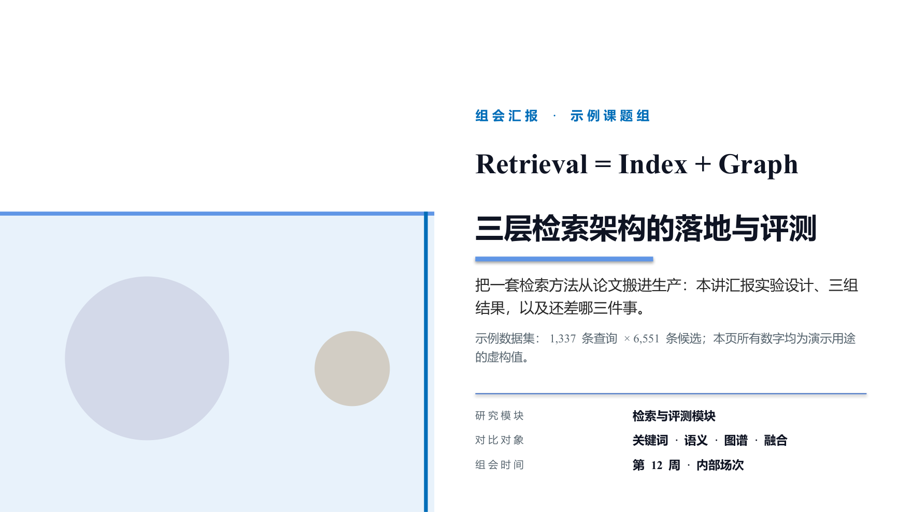
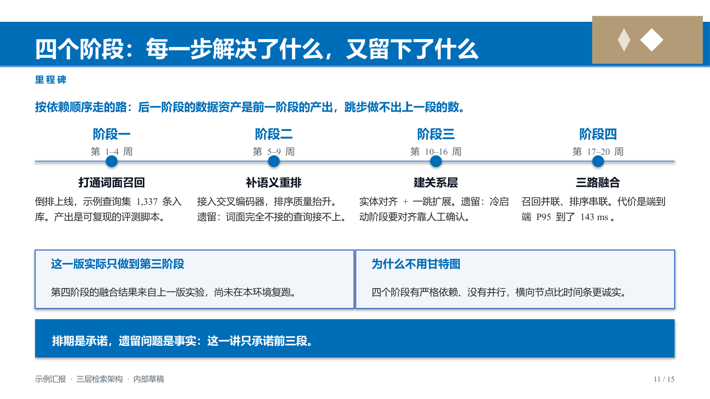
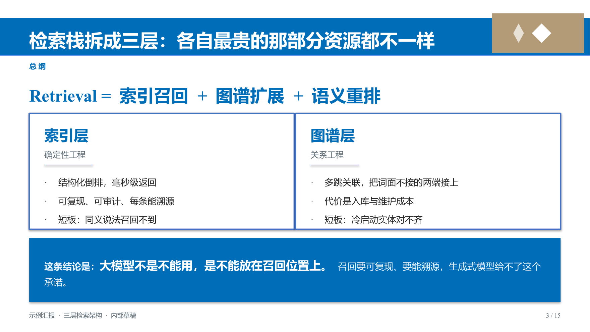
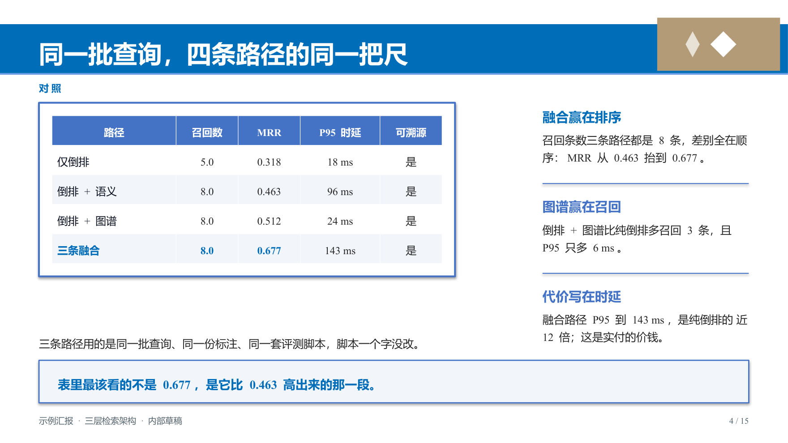
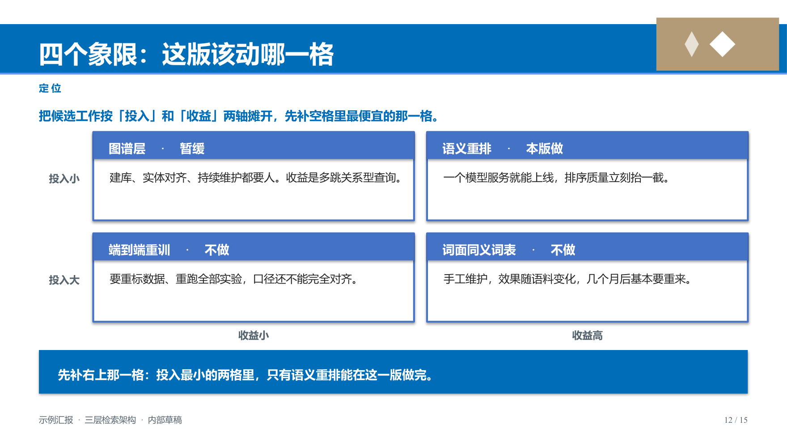
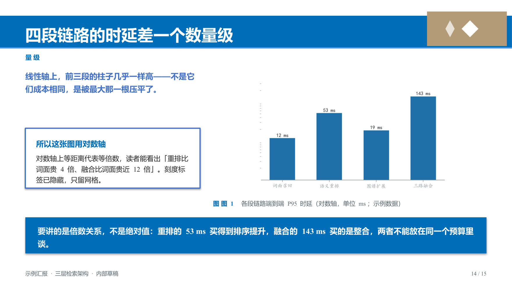

# 科研汇报 PPT 生成器

**`research-ppt-builder`** · [English](README_EN.md)

把实验内容整理成可以直接汇报的 PPT：可以沿用自己的模板，也可以使用内置主题或不提供模板直接生成；同时自动生成演讲者备注和讲稿，并在交付前检查文字溢出、对比度和版面问题。

[](https://www.python.org/)
[](#需要装什么)
[](#六套主题)
[](#四道闸门)
[](LICENSE)

---

## 项目结构

```
research-ppt-builder/
├── SKILL.md              给 AI 用的操作说明（八步工作流）
├── README.md             本文件 · 中文
├── README_EN.md          English
├── requirements.txt
├── assets/
│   ├── themes/           六套主题母版 + 色板定义（pptx / json，含一套暗底）
│   └── figures/          matplotlib 出图示例
├── references/           深入资料，按需查阅
│   ├── design-language.md     色板、栅格、字体：为什么这么定
│   ├── design-principles.md   设计技巧：标题、层级、边界、布局的判断标准
│   ├── page-recipes.md        十八种页型的几何配方
│   ├── figures-and-charts.md  图表：原生图 vs matplotlib 怎么选
│   ├── image-handling.md      配图的三种处理方式
│   ├── template-intake.md     接入你自己的 pptx 模板
│   ├── narration.md           讲稿写法与数据口径纪律
│   ├── qa-gates.md            四道闸门抓什么、阈值怎么调
│   └── pitfalls.md            踩过的坑（先查这里）
├── scripts/
│   ├── build_deck.py         出稿：15 页示例稿
│   ├── kit.py                组件库：文本、表格、图表、图片、栅格
│   ├── make_neutral_template.py  生成主题母版
│   ├── analyze_template.py   从任意 pptx 反推视觉语言
│   ├── figstyle.py           matplotlib 图表风格预设
│   ├── qa_fit.py  qa_pdf.py  qa_visual.py  qa_layout.py   四道闸门
│   └── verify_all.py         一键：出稿 → 渲染 → 四道闸门
└── docs/images/            README 用到的截图
```

## 适合什么场景

这个项目适合用 Python 生成科研汇报、开题、中期汇报、答辩、项目评审和学术报告 PPT。你可以：

- 使用自己的 `.pptx` 模板，也可以使用内置的六套主题；
- 不提供模板，直接使用内置主题生成一份基础汇报稿；
- 把实验背景、方法、结果和结论整理成多种常用页型；
- 同时生成幻灯片备注和逐页 markdown 讲稿，避免两份内容不一致；
- 在导出后自动检查文字是否放得下、图片是否变形、颜色是否清楚、版面是否异常。

使用自己的模板时，通常能更好地保持已有的视觉规范。不提供模板时，项目会使用内置主题和预设页型，仍然可以生成完整 PPT，但版式与视觉效果更依赖内容类型和自动排版结果，通常不如经过整理的专用模板稳定。它不是 PowerPoint 的通用编辑器，也不负责生成复杂动画、海报或竖版页面。

## 在 Agent 中使用

推荐让 Codex、Claude Code、Cursor Agent 或其他能读写项目文件的 Agent 在项目根目录工作。先把 `research-ppt-builder` 作为 Skill 提供给 Agent，再把自己的模板和实验资料放进项目，最后让 Agent 修改 `scripts/build_deck.py` 并运行验收命令。

### 先加载 Skill

提示词中要明确告诉 Agent 使用 `research-ppt-builder` skill。这个 Skill 的完整说明在项目根目录的 [`SKILL.md`](SKILL.md)，其中包含从整理内容、选择页型到生成 PPT 和运行验收的完整流程。

不同 Agent 的 Skill 配置方式不同：

- 如果 Agent 已经安装了 `research-ppt-builder`，直接在提示词中写“请使用 `research-ppt-builder` skill”；
- 如果 Agent 没有自动发现它，请把本项目目录作为 Skill 目录，或明确要求它先读取项目根目录的 `SKILL.md`；
- 不要只把 `README.md` 当作 Skill。README 用来说明安装和使用方式，具体执行流程以 `SKILL.md` 为准。

### 最简单的提示词

可以直接使用下面这段提示词，再补充你的实验信息：

```text
请帮我针对这个 PPT 模板，结合我的实验内容，做出本次科研汇报 PPT。

请先加载并使用 `research-ppt-builder` skill。若当前 Agent 没有自动加载 Skill，请读取项目根目录的 `SKILL.md`，再阅读 README.md 和 references/ 目录中与任务相关的说明。
我的模板是：assets/my-template.pptx
我的实验资料在：references/my-experiment/ 或我接下来提供的文件中
汇报时长：15 分钟
听众：本课题组师生
重点：实验问题、方法、最重要的结果、局限和下一步计划

请按以下步骤完成：
1. 先根据资料列出页标题和每页要表达的一个结论；
2. 使用我的模板生成 PPT，不要凭空编造实验数据；
3. 为每页添加演讲者备注，并导出逐页讲稿 markdown；
4. 运行四道验收闸门，修复发现的问题后再交付；
5. 告诉我生成了哪些文件、使用了哪些假设，以及还有哪些问题需要我确认。
```

### 有自己的模板时

先分析模板：

```powershell
python scripts\analyze_template.py "assets\my-template.pptx" -o assets\my-theme.json
```

然后把模板路径、实验资料路径、汇报时长和听众写进提示词。可以这样说：

```text
请使用 assets/my-template.pptx 作为母版，不要重新设计一套风格。
请先运行 analyze_template.py，确认可用的版式和主题色，再修改出稿脚本。
如果模板缺少合适的版式，请复用最接近的版式并告诉我，不要默默新造一套视觉规范。
```

### 没有现成模板时

直接指定主题即可：

```text
请使用 academic-blue 主题生成一份 12 页的科研汇报 PPT。
内容来自 references/my-experiment/，所有数字必须能在资料中找到。
请优先使用“问题-方法-结果-结论-下一步”的结构，并根据 references/page-recipes.md 选择页型。
我没有自己的 PPT 模板，请直接使用项目内置主题和页型。请说明这种方式可能带来的版式限制，并在生成后运行四道验收闸门。
```

### 让 Agent 修改已有稿件

如果已经有一份能运行的 `build_deck.py`，不必让 Agent 重写整个项目。直接指出要改的内容：

```text
请只修改 scripts/build_deck.py：
- 把第 6 页改成实验流程图；
- 把第 9 页的结果图替换为 assets/figures/result.png；
- 保留现有主题、页脚和讲稿格式；
- 修改后运行 python scripts/verify_all.py，并修复与本次修改有关的闸门错误。
```

### 使用 Agent 时要明确的边界

- 不确定的实验数据、统计结果和结论必须标记出来并询问，不要补写；
- 模板中的校徽、机构标识、照片和版权图片由使用者负责确认；
- 让 Agent 修改页面后必须重新运行验收，不要只看生成脚本是否能执行；
- 如果 Agent 无法访问本地文件或运行命令，请让它先给出修改方案，再由你在项目目录中执行。

## 它能做什么

**支持三种出稿方式。** 可以使用自己的 `.pptx` 模板，沿用里面的版式、配色和装饰；也可以使用内置的六套主题；如果没有模板，也可以直接用内置主题和页型生成基础汇报稿。后两种方式更依赖预设规则，视觉一致性通常不如专用模板。

**自动配讲稿。** 幻灯片和讲稿读同一份数据。写进备注的是讲稿，导出成 markdown 的也是它，
数字不会对不上。

**出稿后自动查四类问题。** 文字溢出、对比度不足、版面空洞、模板仿歪——
这四件事用眼睛查不干净，所以交给四段代码。查完给一个退出码，可以挂进 CI。

**三种配图方式。** 无图、图已经命名好（你指定放哪页哪个位置，它不认也不改）、
图是 `1.png` `2.jpg` 这种没意义的文件名（它自己看图判断放哪、配什么图注，然后交你确认）。

**六套主题。** 商务蓝、学术红、极简黑白，另加暗底 midnight、深绿 forest-green、暖白 warm-sand。六套都跑过四道闸门。

**图表两种做法。** 默认用 PowerPoint 原生图表（可编辑、体积小）；
需要复杂样式时用 matplotlib 出图，配一套现成的风格预设。

## 成品长什么样

15 页示例稿的其中六页。数据全是编的，看版式就行。

| 封面 | 里程碑 |
|---|---|
|  |  |

| 三层结构 | 对照表 |
|---|---|
|  |  |

| 四象限 | 对数坐标图表 |
|---|---|
|  |  |

## 需要装什么

| | 要求 | 说明 |
|---|---|---|
| Python | ≥ 3.10 | 3.12 验证过 |
| `python-pptx` | ≥ 1.0.2 | 必需，出稿和闸门都靠它 |
| `pymupdf` `pillow` | — | 必需，闸门读渲染结果、算图片宽高比 |
| `matplotlib` | ≥ 3.7 | 可选，只在你要自己出实验图时才用得上 |
| LibreOffice | 任意近期版本 | 必需，用于把 PPT 渲染成 PDF 给闸门检查。**不在 PATH 上时要写全路径** |

一条命令装齐 Python 依赖：

```powershell
pip install -r requirements.txt
```

`SKILL.md` 里还有一条给 AI 用的技能入口，装成 agent skill 后可以直接调用。

## 五分钟上手

```powershell
# 1. 出一份示例稿看看
python scripts\build_deck.py

# 2. 跑一遍验收（LibreOffice 要写全路径）
python scripts\verify_all.py --soffice "C:\Program Files\LibreOffice\program\soffice.exe"
```

跑完 `out/` 里会有三个文件：

| 文件 | 是什么 |
|---|---|
| `示例汇报_中文科研组会.pptx` | 15 页幻灯片，含演讲者备注 |
| `示例汇报_中文科研组会_讲稿.md` | 逐页讲稿 + 预设问答 |
| `out/render/*.pdf` | 渲染出来的 PDF，用来看版面 |

**换成自己的内容：**

```powershell
Copy-Item scripts\build_deck.py my_deck.py
```

然后改 `my_deck.py` 里的 `DECK`（标题、页脚、页数）和 `PAGES`（要哪些页型）。
每一页的文案照着 [`references/page-recipes.md`](references/page-recipes.md) 里的配方改。

**用自己的模板：**

```powershell
python scripts\analyze_template.py "D:\你的模板.pptx" -o theme.json
```

按 [`references/template-intake.md`](references/template-intake.md) 把色板的语义补完，
之后页面代码一个字都不用改。

**改完一定要重跑闸门。** 这是这个包唯一的要求。

## 常用命令

```powershell
# 换主题
python scripts\verify_all.py --theme scholar-red --soffice "C:\...\soffice.exe"

# 中文字体换成楷体
python scripts\build_deck.py --zh-kaiti

# 只验现成的稿子
python scripts\verify_all.py --pptx "D:\我的汇报.pptx" --soffice "C:\...\soffice.exe"

# 看某个模板长什么样
python scripts\analyze_template.py "D:\你的模板.pptx" -o theme.json
```

退出码：`0` 全部通过 · `1` 有闸门失败 · `2` 环境不全（LibreOffice 找不到、稿子指错路径等）。
**缺 LibreOffice 时不会假装通过**，会直接告诉你哪三道闸门没跑。

## 四道闸门

| 闸门 | 查什么 | 在哪一层看 |
|---|---|---|
| `qa_fit.py` | 文字溢出、表格压页脚、图片拉伸、越界 | 源码几何，不用渲染，最快 |
| `qa_pdf.py` | 越界、压页脚、行重叠、图片变形、稀页 | 渲染后的真实落位 |
| `qa_visual.py` | 逐片段对比度、文字出框 | 前两道都看不见颜色 |
| `qa_layout.py` | 越出组件、大空隙、提前收工、偏空 | 好不好看 |

`qa_fit` 值得单独说一句：它是唯一能在渲染之前抓到文字溢出的那道。字宽是用真实字体文件
实测的，不是拍的经验系数——换字体时经验系数必然全错。

阈值能调，但**先查是不是量错了**，别直接放宽。调法见 [`references/qa-gates.md`](references/qa-gates.md)。

## 六套主题

栅格和字体六套一样，只换色板、页面底色和母版装饰色。

| | academic-blue | scholar-red | minimal-mono | midnight | forest-green | warm-sand |
|---|---|---|---|---|---|---|
| 底色 | 白 | 白 | 白 | 深海军蓝 `101C2E` | 白 | 暖白 `FBF7F1` |
| 基色 | `006DB8` | `8A2B34` | `2F2F2F` + 陶土橙 | 浅蓝 `9AC7EE` | 深绿 `1B5E3A` | 暖褐 `8A5A2B` |
| 适合 | 组会汇报、学术报告、对外介绍 | 开题/中期、答辩 | 黑白打印、外部评审 | 大屏投影、keynote、暗环境 | 环境/生态/材料/地学课题 | 人文/社科/医学、报告附录 |
| 投影 | 亮环境 | 亮环境，偏色投影上红会偏紫 | 亮暗都行 | 暗环境首选 | 亮环境 | 亮环境 |

完整色板、每个色的实测对比度、什么时候不能用哪一档，在
[`references/design-language.md`](references/design-language.md)。

## 什么时候用它

如果你需要反复生成结构相近的科研汇报，或者希望把模板、讲稿和版面检查纳入脚本，适合使用这个项目。它和几种常见做法的区别如下：

| 做法 | 出稿 | 谁发现溢出 / 对比度 / 版面问题 |
|---|---|---|
| 让 AI 直接写 `python-pptx` | 快速生成一版 | 通常需要人工检查版面 |
| 下载现成模板 `.potx` | 往占位符填内容 | 塞不下时需要手动调整 |
| Marp / Quarto | markdown 转页 | 样式锁死，换不了自己的模板 |
| PowerPoint Designer | 在界面中排版 | 不方便做可重复的批量生成和回归检查 |
| 本项目 | Python 生成并运行四道闸门 | 适合固定模板、重复汇报和 CI |

本项目的几个关键约定：

1. 验收脚本返回退出码，可以接入 CI；
2. 使用模板的母版和版式，不把装饰元素重新画一遍；
3. 幻灯片备注和 markdown 讲稿读取同一份内容；
4. 中文字体、图片比例和常见版面问题有对应的检查脚本。

它不适合海报、竖版页面、复杂动画或需要在 PowerPoint 界面里逐页手工设计的任务。换主题比较简单，改变整套栅格则通常需要同步修改页面代码。

## 遇到问题

| 现象 | 先看 |
|---|---|
| 报 `KeyError: 缺少版式 [...]` | [`references/template-intake.md`](references/template-intake.md) |
| 闸门报错、想调阈值 | [`references/qa-gates.md`](references/qa-gates.md) |
| 图放进去变形 / 找不到 | [`references/image-handling.md`](references/image-handling.md) |
| LibreOffice 渲染不出 PDF | `references/qa-gates.md`（有几个静默失败的坑） |
| 别的奇怪现象 | [`references/pitfalls.md`](references/pitfalls.md) |

## 许可与免责

- 许可证 [MIT](LICENSE)。
- 示例数据**全部虚构**，一眼假。照抄时请换成真实口径，并遵守
  [`references/narration.md`](references/narration.md) 里的数据纪律。
- 内置母版零机构标识、零位图。`assets/figures/` 里的示例图由本包脚本生成。
- **用你自己的模板时**，里面的机构标识、校徽、照片和版权归你——这个包不替你判断。
- 产物的 `docProps` 元数据已被脚本统一擦除（作者、生成器、时间戳），可以放心公开。
